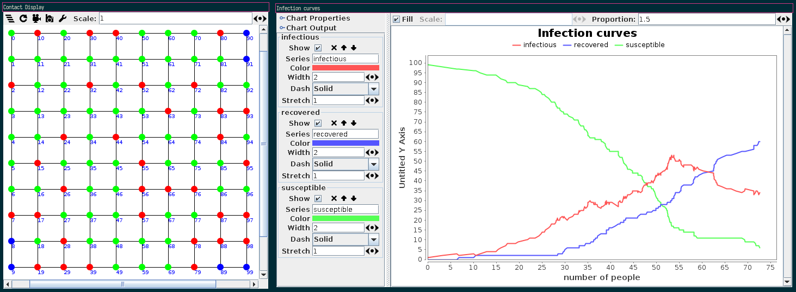

:construction: This prototype is in the process of being refined and may exhibit bugs :construction:

# mason-ssa: An SSA extension for MASON

This extension to the [MASON framework](https://cs.gmu.edu/~eclab/projects/mason/) provides facilities to implement agent-based models (ABM) and simulating them via stochastic simulation algorithms (SSAs).
Its key feature is the support of automatic dependency-tracking using an aspect-oriented approach. This way it combines the benefits from both worlds:
**model definition in a general purpose language** (Java) and **increased performance** when inter-agent dependencies can be exploited during a simulation step.
Supported SSAs:



- First Reaction Method
- Direct Method
- Next Reaction Method (with dependency tracking)
- Direct Method (with dependency tracking)

## Getting Started

### :white_check_mark: Prerequisites

- Maven (tested with 3.8.2)
- Java 8 (or compatible)
- MASON
  - the version found on the Maven Central Repository is out of date (14.0)
  - Version 20 can be installed from its [GitHub repository](https://github.com/eclab/mason)

### :cd: Installation

- clone this repository: `git clone https://github.com/justinnk/mason-abm-ssa.git`
- install the extension in your local repository: `mvn clean install`

### :rocket: Run Demo Model

- run `./demo/run_showcase.sh`
- The script currently only works / is only tested on Linux
- with some adaptions, it should also run on windows
- todo: add batch script

## :arrow_forward: Usage

1. In your maven `pox.xml` add the following dependencies
  ```xml
  <dependecies>
    <dependency>
      <groupId>org.justinnk.masonssa</groupId>
      <artifactId>extension</artifactId>
      <version>0.0.1-SNAPSHOT</version>
    </dependency>
    <dependency>
      <groupId>org.justinnk.masonssa</groupId>
      <artifactId>aspects-base</artifactId>
      <version>0.0.1-SNAPSHOT</version>
    </dependency>
    <dependency>
      <groupId>org.justinnk.masonssa</groupId>
      <artifactId>aspects-nrm</artifactId>
      <version>0.0.1-SNAPSHOT</version>
    </dependency>
    <dependency>
      <groupId>org.justinnk.masonssa</groupId>
      <artifactId>aspects-odm</artifactId>
      <version>0.0.1-SNAPSHOT</version>
    </dependency>
  </dependencies>
  ```

2. In order to weave the aspects, the following plugin has to be added in the `plugins` section of your `pom.xml`
  ```xml
  <plugin>
    <groupId>com.nickwongdev</groupId>
    <artifactId>aspectj-maven-plugin</artifactId>
    <version>1.12.6</version>
    <configuration>
      <proc>none</proc>
      <complianceLevel>1.8</complianceLevel>
      <source>1.8</source>
      <target>1.8</target>
      <showWeaveInfo>true</showWeaveInfo>
      <verbose>true</verbose>
      <Xlint>error</Xlint>
      <encoding>UTF-8</encoding>
      <forceAjcCompile>false</forceAjcCompile>
      <!-- enable weaving for mason-internal classes and extension classes -->
      <weaveDependencies>
        <weaveDependency>
          <groupId>cs.gmu.edu.eclab</groupId>
          <artifactId>mason</artifactId>
        </weaveDependency>
        <weaveDependency>
          <groupId>org.justinnk.masonssa</groupId>
          <artifactId>extension</artifactId>
        </weaveDependency>
      </weaveDependencies>
      <!-- include aspects from the ssa extension -->
      <aspectLibraries>
        <aspectLibrary>
          <groupId>org.justinnk.masonssa</groupId>
          <artifactId>aspects-base</artifactId>
        </aspectLibrary>
        <!-- if you want to use the ODM instead, include aspects-odm here -->
        <aspectLibrary>
          <groupId>org.justinnk.masonssa</groupId>
          <artifactId>aspects-nrm</artifactId>
        </aspectLibrary>
      </aspectLibraries>
    </configuration>
    <executions>
      <execution>
        <!-- only weave after classes are compiled by javac -->
        <goals>
          <goal>compile</goal>
        </goals>
      </execution>
    </executions>
    <dependencies>
      <dependency>
        <groupId>org.aspectj</groupId>
        <artifactId>aspectjtools</artifactId>
        <version>1.9.6</version>
      </dependency>
    </dependencies>
  </plugin>
  ```

3. Now you can use the extension like described in the documentation section

## :book: Documentation

TODO
see `demo` module for now.

## Roadmap

- Add the plugin to maven central
  - set up GitHub CI/CD
- (Re-)implement automatic performance checking for easy testing of improvements
- Improve dependency graph efficiency
- implement capabilities left as future work

## :woman_technologist: :man_technologist: Contributing

Feel free to open issues.
The project is still in the process of being prepared for contributions (i.e. documentation, source-code comments, etc. have to be refined/added).
Once this is done, see [Contributing](CONTRIBUTING.md) for more information.

## :balance_scale: License

This project is distributed under the terms of the Apache-2.0 license, see [LICENSE](LICENSE).
This project makes use of external libraries. Their copyright information can be found in [NOTICES](NOTICES).

## Literature

- Tutorial: [preliminary version](literature/tutorial.pdf)
- Thesis: [abstract](literature/thesis_abstract.pdf)
- Paper: to be published

## Cite

```
TODO
```
